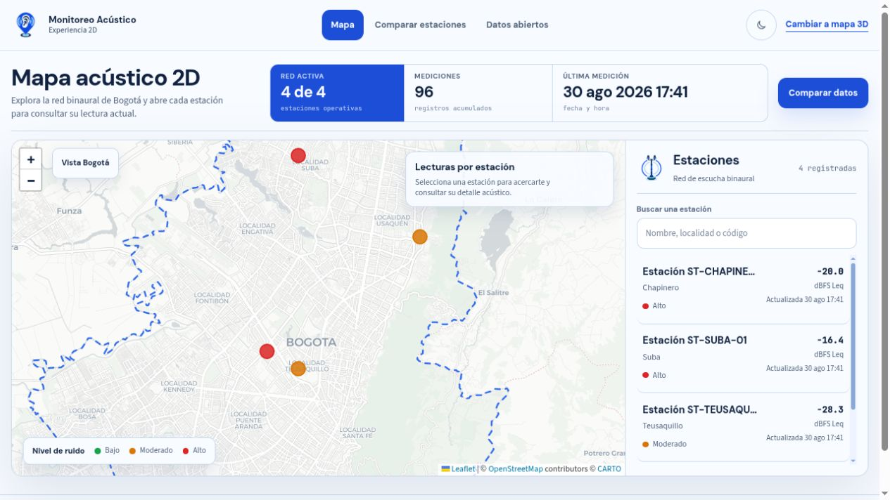
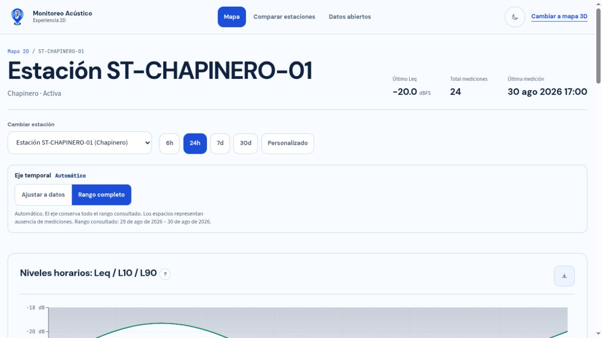
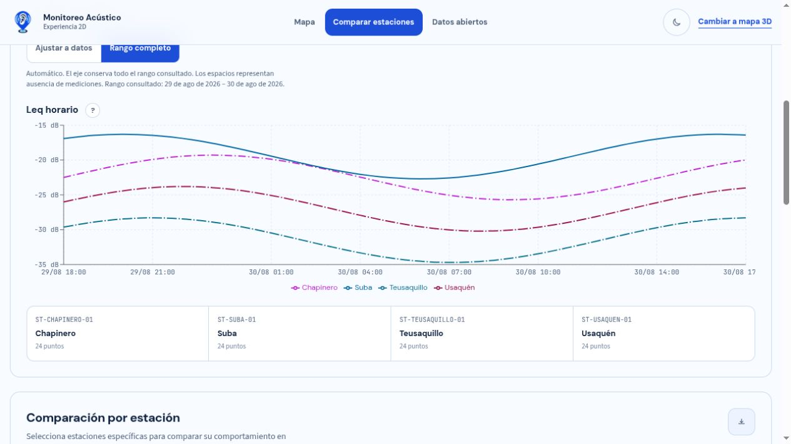
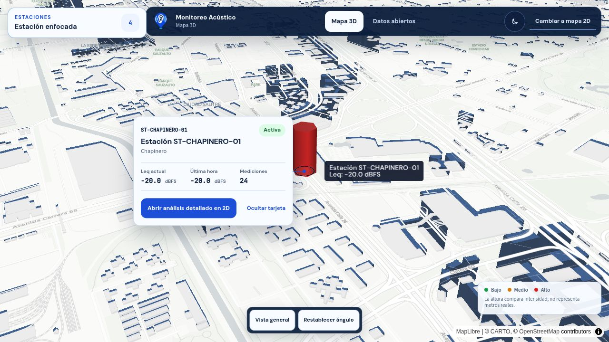
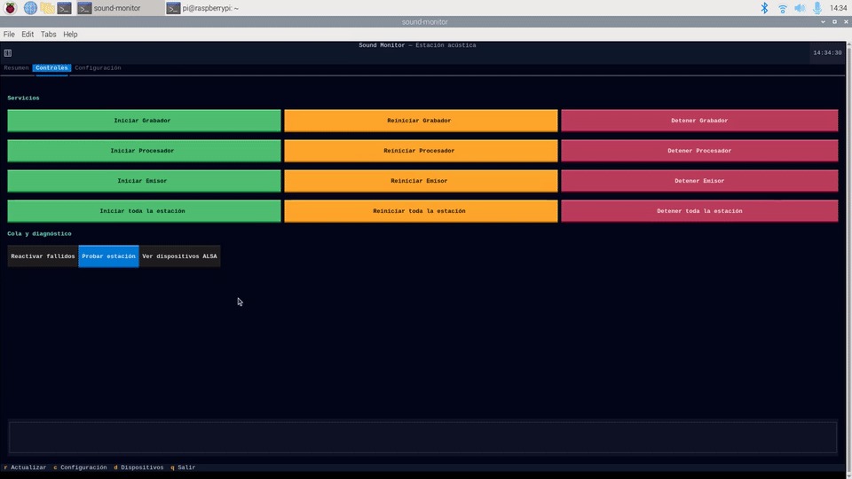
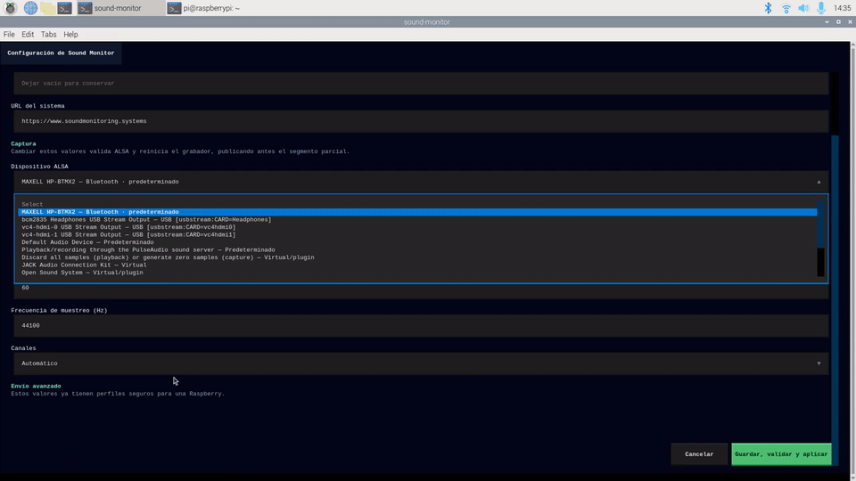
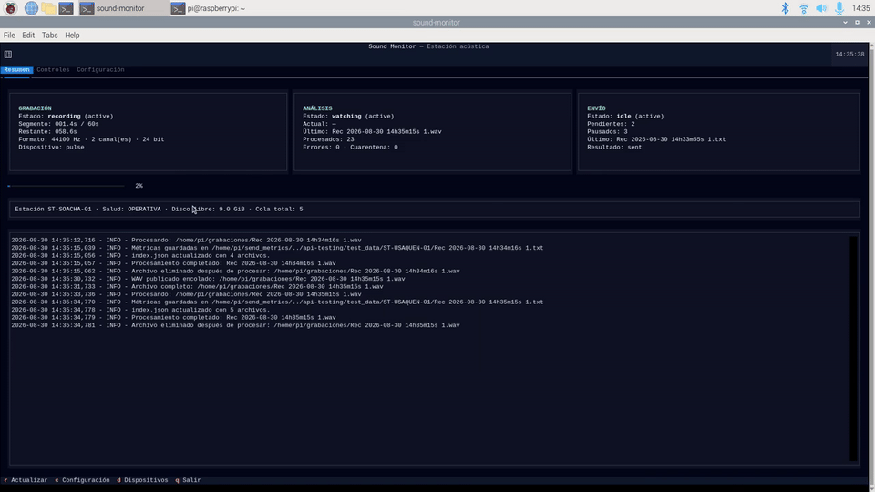
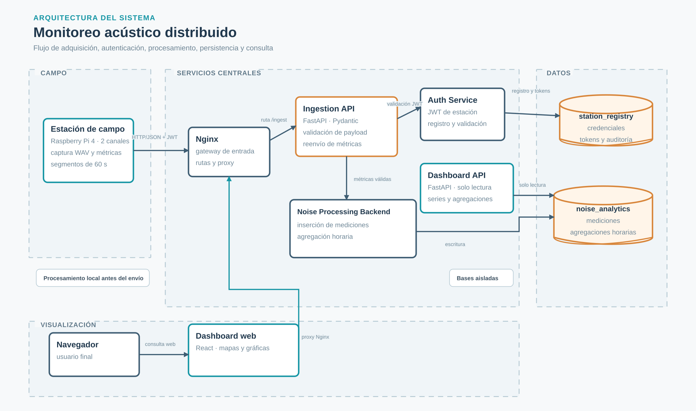

# Sound Monitoring System

Sistema de Monitoreo Acustico Binaural para Bogota D.C.

Captura metricas de ruido ambiental desde estaciones distribuidas (Raspberry Pi con microfono estereo), las transmite a un servidor central donde son validadas, almacenadas y agregadas, y las presenta en un dashboard web interactivo con mapas y graficas.

Repositorio: [github.com/AndresPescador/Sound-Monitoring-System](https://github.com/AndresPescador/Sound-Monitoring-System)

---

## Vistas del dashboard

Estas vistas muestran las principales capacidades del dashboard: ubicación de
estaciones, detalle de métricas, comparación entre puntos de monitoreo y
visualización tridimensional de la red acústica.

| Mapa 2D | Detalle de estación |
|---|---|
|  |  |

| Comparación | Mapa 3D |
|---|---|
|  |  |

---

## TUI de la estación Raspberry Pi

La interfaz de la estación concentra las acciones operativas, la configuración
y el retorno al estado de monitoreo.

### Matriz de acciones



### Configuración



### Retorno operativo



Consulta la [galería completa de la TUI](docs/tui-demo.md), que incluye los
seis GIF y sus MP4 fuente.

---

## Arquitectura general



El diagrama resume el recorrido de las métricas desde las estaciones de campo
hasta los servicios, las bases de datos aisladas y el dashboard web.

```
Raspberry Pi (estacion de campo)
    │  process_audio.py  →  archivos .txt con metricas JSON
    │  send_metrics.py   →  envio HTTPS al dominio publico
    ▼
Nginx + Certbot de la VPS (puertos 80/443, TLS y HSTS)
    └── 127.0.0.1:8080 → Gateway Nginx de Docker
            ├── /auth/*             → Auth Service (Spring Boot, puerto 8081)
            ├── /ingest/*           → Ingestion API (FastAPI, puerto 8000)
            ├── /processing/admin/* → Noise Processing Backend (puerto 8082)
            └── /dashboard/*        → Dashboard API (FastAPI, puerto 8083)
            └── /*                  → Dashboard Frontend (React/Nginx, puerto interno 8080)

PostgreSQL — dos bases de datos aisladas
    ├── station_registry   → auth_app (escritura restringida)
    └── noise_analytics    → noise_writer + dashboard_reader (solo lectura)

Redis — rate limiting compartido de Auth Service (sin puerto publicado)
```

---

## Componentes

### auth-service
Servicio de autenticacion de estaciones. Desarrollado con Spring Boot.

- Registra estaciones y genera un secret aleatorio (hash BCrypt).
- Emite tokens JWT cuando una estacion presenta su secret.
- Valida tokens a peticion de la Ingestion API.
- Expone endpoints de administracion protegidos con JWT y roles.
- Persiste en la base de datos `station_registry`.

Referencia: [auth-service/README.md](auth-service/README.md)

---

### ingestion-api
Capa de ingesta de metricas. Desarrollada con FastAPI (Python).

- Recibe el JSON de metricas enviado por cada estacion.
- Valida el formato con modelos Pydantic.
- Verifica el token JWT llamando al Auth Service.
- Reenvía las metricas al Noise Processing Backend.

Referencia: [ingestion-api/README.md](ingestion-api/README.md)

---

### noise-processing-backend
Servicio de procesamiento y persistencia acustica. Desarrollado con Spring Boot.

- Recibe las metricas validadas de la Ingestion API.
- Persiste cada fragmento en `acoustic_measurements`.
- Calcula y actualiza agregaciones horarias (Leq, L10, L50, L90) en `hourly_aggregations`.
- Detecta y descarta duplicados.
- Expone endpoints de administracion para registrar estaciones en `noise_analytics`.

Referencia: [noise-processing-backend/README.md](noise-processing-backend/README.md)

---

### dashboard-api
API de consulta para el dashboard. Desarrollada con FastAPI (Python).

- Solo lectura. Se conecta a `noise_analytics`.
- Expone endpoints de series temporales, agregaciones horarias, perfil diario, comparacion entre estaciones, metricas binaurales y espectrales.
- Optimizada para alimentar los componentes Recharts y el mapa Leaflet del frontend.

Referencia: [dashboard-api/README.md](dashboard-api/README.md)

---

### dashboard-frontend
Interfaz web. Desarrollada con React 18 + Vite + Tailwind CSS.

- Panel principal con cards de resumen y mapa de Bogota (Leaflet).
- Pagina de detalle de estacion con graficas de nivel, bandas, perfil diario, binaurales y espectrales.
- Pagina de comparacion entre estaciones.
- Portal de datos abiertos con descarga CSV.

Referencia: [dashboard-frontend/README.md](dashboard-frontend/README.md)

---

### send_metrics
Cliente Python que corre en cada Raspberry Pi.

- Detecta los archivos de metricas generados por `process_audio.py`.
- Solicita y renueva el token JWT automaticamente.
- Envia los archivos a la Ingestion API en ciclos configurables.
- Gestiona backlog, reintentos y registro de archivos enviados.
- Se puede configurar como servicio systemd para arranque automatico.

Referencia: [send_metrics/README.md](send_metrics/README.md)

---

### docker
Orquestacion completa del sistema con Docker Compose.

- Define todos los servicios: dos instancias de PostgreSQL, Auth Service, Noise Processing Backend, Ingestion API, Dashboard API, Dashboard Frontend y Nginx.
- Los schemas SQL se aplican automaticamente en el primer arranque.
- Nginx Docker actúa como gateway interno en loopback; el Nginx de la VPS
  termina TLS en los puertos públicos 80/443.

Referencia: [docker/README.md](docker/README.md)

---

### api-testing
Colecciones Postman para pruebas manuales de los endpoints.

- `monitoreo_acustico.postman_collection.json` — Ingestion API y Auth Service.
- `dashboard_api.postman_collection.json` — Dashboard API.

### Pruebas y CI

El workflow de GitHub Actions ejecuta en paralelo las pruebas unitarias, los
builds y los contratos portables de cada componente. Los entornos del CI
coinciden con los Dockerfiles: Java 17, Python 3.11 y Node 20.

```bash
cd auth-service && mvn verify
cd noise-processing-backend && mvn verify
cd ingestion-api && pip install -r requirements-dev.txt && python -m pytest
cd dashboard-api && pip install -r requirements-dev.txt && python -m pytest
cd send_metrics && pip install -r requirements-dev.txt && python -m pytest
cd dashboard-frontend && npm ci && npm test && npm run build
cmake -S send_metrics/recorder -B /tmp/continuous-recorder-build -DBUILD_TESTING=ON
cmake --build /tmp/continuous-recorder-build
ctest --test-dir /tmp/continuous-recorder-build --output-on-failure
```

La cobertura se publica como artefacto del workflow sin umbral bloqueante
inicial. La integración completa con Docker Compose y PostgreSQL permanece
reservada para una segunda fase manual o programada.

---

## Bases de datos

### station_registry
Gestionada exclusivamente por el Auth Service.

| Tabla | Descripcion |
|---|---|
| `registered_stations` | Estaciones autorizadas con hash del secret (BCrypt) |
| `api_tokens` | Tokens JWT emitidos, con soporte de revocacion individual |
| `auth_audit_log` | Registro inmutable de todos los eventos de autenticacion |
| `admin_users` | Administradores humanos y versión de credenciales |
| `station_code_counters` | Consecutivos atómicos por localidad |

Schema: [schema_station_registry.sql](schema_station_registry.sql)

### noise_analytics
Gestionada por el Noise Processing Backend. Consultada por el Dashboard API.

| Tabla | Descripcion |
|---|---|
| `stations` | Metadatos y ubicacion geografica de cada estacion |
| `acoustic_measurements` | Metricas crudas por fragmento de audio (60 s por defecto, configurable) |
| `hourly_aggregations` | Leq, L10, L50, L90 y estadisticas calculadas por hora y estacion |

Schema: [schema_noise_analytics.sql](schema_noise_analytics.sql)

---

## Metricas acusticas capturadas

| Metrica | Descripcion |
|---|---|
| `leq_dbfs` | Nivel equivalente continuo con ponderacion A (IEC 61672) |
| `dbfs_level` | Nivel RMS global en dBFS |
| `rms_energy` | Energia RMS lineal [0.0 - 1.0] |
| `ch_left_dbfs` / `ch_right_dbfs` | Nivel dBFS por canal |
| `ild_db` | Diferencia de nivel interaural (izquierdo - derecho) |
| `interaural_correlation` | Correlacion entre canales (+1.0 = campo difuso, ~0 = fuente lateral) |
| `dominant_frequency` | Frecuencia dominante estimada via STFT (Hz) |
| `spectral_centroid` | Centro de masa espectral (Hz) |
| `spectral_rolloff` | Frecuencia que acumula el 85% de la energia espectral (Hz) |
| `zero_crossing_rate` | Tasa de cruces por cero |

---

## Tecnologias

| Componente | Tecnologia principal |
|---|---|
| auth-service | Java 17, Spring Boot 3, Spring Security, PostgreSQL, JWT |
| noise-processing-backend | Java 17, Spring Boot 3, Spring Data JPA, PostgreSQL |
| ingestion-api | Python 3.11, FastAPI, Pydantic, httpx |
| dashboard-api | Python 3.11, FastAPI, SQLAlchemy (async), asyncpg |
| dashboard-frontend | React 18, Vite 5, Tailwind CSS 3, Recharts, Leaflet |
| send_metrics | Python 3.9+, httpx |
| Infraestructura | Docker, Docker Compose, Nginx, PostgreSQL 16 |

---

## Requisitos previos

- Docker Engine y Docker Compose (o Docker Desktop)
- Red local con IP estatica en el servidor (para la comunicacion con las Raspberry Pi)
- Raspberry Pi con microfono estereo y Python 3.9+ (para las estaciones de campo)

---

## Despliegue rapido

### 1. Clonar el repositorio

```bash
git clone https://github.com/AndresPescador/Sound-Monitoring-System.git
cd Sound-Monitoring-System
```

### 2. Configurar variables de entorno

```bash
cd docker
cp .env.example .env
```

Editar `.env` y completar al menos:

| Variable | Descripcion |
|---|---|
| `POSTGRES_NOISE_PASSWORD` | Contrasena de la BD de metricas |
| `POSTGRES_AUTH_PASSWORD` | Contrasena de la BD de autenticacion |
| `NOISE_PROCESSOR_DB_PASSWORD` | Contrasena exclusiva de `noise_writer` |
| `DASHBOARD_DB_PASSWORD` | Contrasena exclusiva de `dashboard_reader` |
| `AUTH_DB_PASSWORD` | Contrasena exclusiva de `auth_app` |
| `STATION_JWT_SECRET` | Clave exclusiva para tokens de estaciones |
| `ADMIN_JWT_SECRET` | Clave independiente para sesiones administrativas |
| `CORS_ALLOWED_ORIGIN` | Origen HTTPS exacto del frontend |

### 3. Levantar todos los servicios

```bash
docker compose up --build -d
```

La primera vez puede tardar entre 5 y 10 minutos mientras se descargan las imagenes base y se compilan los backends Java.

### 4. Verificar el estado

```bash
docker compose ps
curl http://127.0.0.1:8080/health
curl http://127.0.0.1:8080/auth/health
curl http://127.0.0.1:8080/ingest/health
curl http://127.0.0.1:8080/processing/health
curl http://127.0.0.1:8080/dashboard/health
```

### 5. Crear el acceso administrativo y registrar una estacion

En una instalación nueva, crea el superadministrador mediante
`sql/manage_super_admin.sh bootstrap`. Después inicia sesión en
`/admin/login` y registra la estación primero en Auth y después en Processing.
El secret de estación se muestra una sola vez y debe configurarse en la
Raspberry Pi.

Para una instalación que utilizó credenciales anteriores, aplica
[docker/SECURITY_ROTATION.md](docker/SECURITY_ROTATION.md) antes de exponer el
panel a Internet.

---

## Estructura del repositorio

```
Sound-Monitoring-System/
├── auth-service/                  # Autenticacion y emision de tokens JWT (Spring Boot)
├── ingestion-api/                 # Recepcion y validacion de metricas (FastAPI)
├── noise-processing-backend/      # Procesamiento y persistencia acustica (Spring Boot)
├── dashboard-api/                 # API de consulta para el dashboard (FastAPI)
├── dashboard-frontend/            # Interfaz web (React + Vite)
├── send_metrics/                  # Cliente de envio para Raspberry Pi (Python)
├── docker/                        # Docker Compose, Nginx y variables de entorno
├── docs/                          # Arquitectura, medios y guías operativas
├── api-testing/                   # Colecciones Postman
├── schema_noise_analytics.sql     # Schema de la BD de metricas
└── schema_station_registry.sql    # Schema de la BD de autenticacion
```

---

## Flujo completo de datos

```
1. continuous-recorder + process_audio.py (Raspberry Pi)
      Graba fragmentos WAV de 60 segundos por defecto, calcula metricas acusticas,
      guarda el resultado como archivo .txt en formato JSON.

2. send_metrics.py (Raspberry Pi)
      Detecta archivos nuevos, solicita o renueva el token JWT,
      envía cada archivo a POST /ingest/ingest.

3. Ingestion API
      Valida el formato JSON (Pydantic) y el token JWT (Auth Service),
      reenvía las metricas al Noise Processing Backend.

4. Noise Processing Backend
      Persiste la medicion en acoustic_measurements,
      recalcula la agregacion horaria en hourly_aggregations.

5. Dashboard API
      Expone los datos de noise_analytics para el frontend.

6. Dashboard Frontend
      Muestra el mapa de estaciones, graficas de niveles,
      bandas percentilicas, metricas binaurales y espectrales.
```
