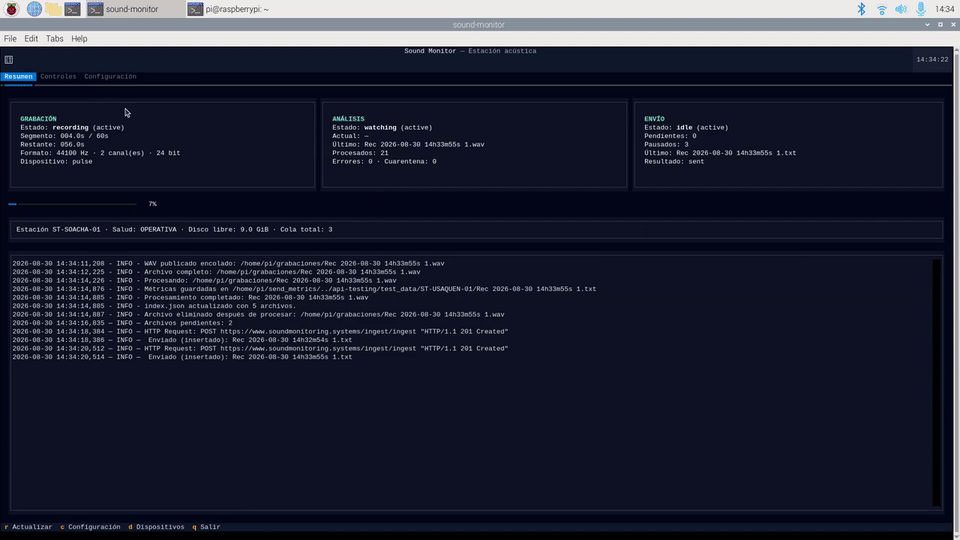
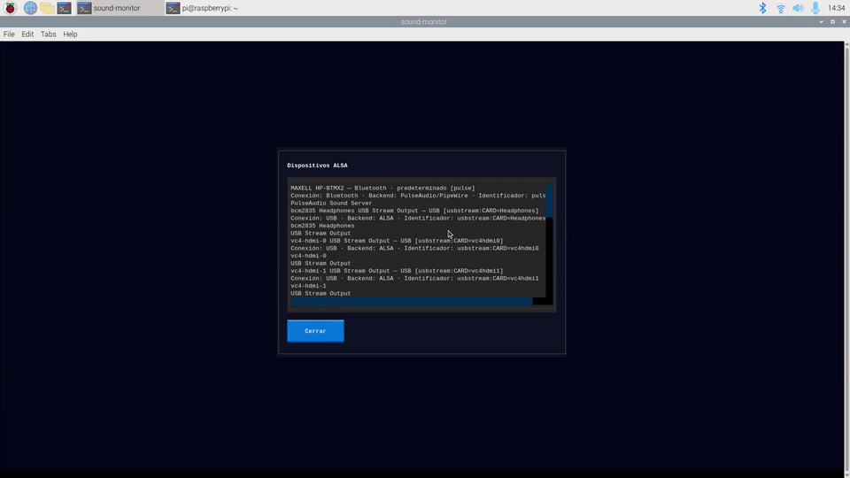
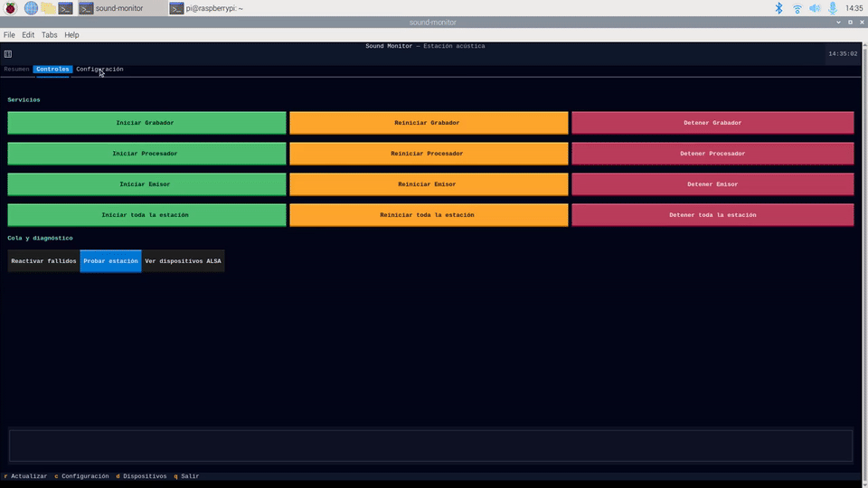

# Galería de la TUI de Raspberry Pi

Esta galería muestra interacciones de la interfaz de estación utilizada para
operar el monitoreo acústico. Cada animación está disponible también como MP4
H.264 horizontal (1280×720), sin pista de audio.

## Panel de estado y acciones

| Cambio de estado a acciones | Matriz y selector |
|---|---|
|  |  |
| [MP4](media/tui/mp4/tui-dashboard-to-actions.mp4) | [MP4](media/tui/mp4/tui-action-matrix-selector.mp4) |

El primer clip muestra el paso desde la telemetría de la estación hacia las
acciones disponibles. El segundo destaca la matriz de controles y la apertura
del selector de comandos.

## Selector y configuración

| Navegación y retorno | Acciones a configuración |
|---|---|
|  |  |
| [MP4](media/tui/mp4/tui-selector-return.mp4) | [MP4](media/tui/mp4/tui-actions-to-configuration.mp4) |

Estos clips enseñan la selección de una acción y la transición hacia el
formulario de configuración de la estación.

## Edición y retorno operativo

| Edición de configuración | Confirmación y retorno |
|---|---|
|  |  |
| [MP4](media/tui/mp4/tui-configuration-edit.mp4) | [MP4](media/tui/mp4/tui-confirmation-return.mp4) |

La secuencia final muestra la selección de parámetros y el regreso de la
interfaz al panel de monitoreo tras completar la operación.
